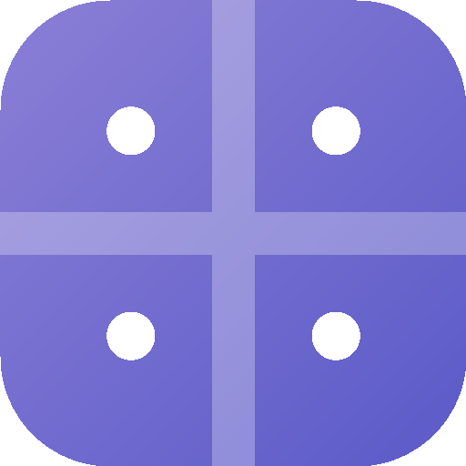

# Quadrante — Personal Life OS

A calm, mobile-first life-management app built around your **four life areas** —
**Spiritual · Wealth · Health · Relationship**. Plan goals, do tasks, build
habits, and watch your **Life Wheel** improve week over week. Designed with a
premium iOS feel and installable as a PWA on your iPhone.



## Features

- **Dashboard** — Life Wheel radar (hero) + a 2×2 grid of area cards, each with
  a live 0–100 score, active goals, today's habits, and the next task.
- **Area pages** — drill into one area: goals with progress, a To-do / Doing /
  Done task board, and one-tap habit check-offs. A color-matched **+** button
  adds whatever you're looking at.
- **Today** — every habit and today's tasks across all four areas on one screen,
  with a daily completion ring.
- **Schedule** — week strip + day/week agenda of time-blocked tasks, ready for
  two-way Google Calendar sync (Quadrante vs Google events are visually
  distinguished; a **Sync** button is wired for when Calendar is connected).
- **Weekly Review** — this week's scores, a trends chart, a one-line reflection
  per area, and next week's focus. Under two minutes.
- **Habit streaks**, per-area **scoring**, **Life Wheel**, and **Trends**.
- **Light / dark** with true-black iOS dark mode, haptics, bottom-sheet forms,
  safe-area aware, **PWA installable**.

## Run locally

```bash
pnpm install
pnpm dev          # http://localhost:3000
```

```bash
pnpm build && pnpm start   # production build
```

No environment variables are required to run — the app persists to your
browser's `localStorage` and seeds your starting data on first load. Open
**Review → Simulate a week** to preview streaks and trends.

> First run seeds the four areas and the starting goals/tasks/habits. To start
> over: **Review → reset** (the circular-arrow button next to *Simulate a week*).

## Install on iPhone (PWA)

1. Open the deployed URL in **Safari**.
2. Share → **Add to Home Screen**.
3. Launch it from the home screen — it runs full-screen, no browser chrome.

## Deploy to Vercel

```bash
# Push to GitHub, then import the repo at vercel.com → New Project.
# Framework preset: Next.js. Build command: pnpm build. No env vars needed
# for the local-storage build.
```

The app is a standard Next.js 14 App Router project, so Vercel auto-detects
everything.

---

## Optional: connect Supabase + Google Calendar

The app ships with a local-storage data layer so it works immediately. The
schema and types are already designed for Supabase, so promoting it to a
real backend is additive, not a rewrite. See `CLAUDE.md` for the architecture.

### 1. Supabase

1. Create a project at [supabase.com](https://supabase.com).
2. Run `supabase/migrations/0001_init.sql` (SQL editor or the Supabase CLI).
   It creates every table and enables **Row Level Security** (owner =
   `auth.uid()`), so no user can ever read another user's rows.
3. Set env vars (see `.env.local.example`):
   - `NEXT_PUBLIC_SUPABASE_URL`, `NEXT_PUBLIC_SUPABASE_ANON_KEY`
   - `SUPABASE_SERVICE_ROLE_KEY` (server only — never exposed to the client)
4. Swap the body of `lib/store.tsx` for Supabase queries. The `useStore()` API
   stays identical, so the UI needs no changes.

### 2. Google Cloud Console (OAuth + Calendar)

1. **APIs & Services → Library →** enable **Google Calendar API**.
2. **OAuth consent screen:** External, add your email as a test user, scopes:
   - `openid`, `email`, `profile`
   - `https://www.googleapis.com/auth/calendar.events`
3. **Credentials → Create OAuth client ID → Web application.**
   - Authorized redirect URIs:
     - `http://localhost:3000/auth/callback` (dev)
     - `https://<your-app>.vercel.app/auth/callback` (prod)
   - Copy the client ID/secret into `GOOGLE_CLIENT_ID` / `GOOGLE_CLIENT_SECRET`,
     and set `GOOGLE_REDIRECT_URI`.
4. In **Supabase → Authentication → Providers → Google**, paste the same client
   ID/secret. In `signInWithOAuth`, request the calendar scope and pass
   `queryParams: { access_type: 'offline', prompt: 'consent' }` so Google
   returns a **refresh token**.
5. **Critical:** Supabase doesn't persist provider tokens. On the OAuth
   callback, capture `provider_refresh_token` **once** and store it in
   `user_google_tokens`. All Calendar calls mint a fresh access token from that
   refresh token server-side (`https://oauth2.googleapis.com/token`). Tokens
   never touch the client.

### 3. Calendar sync (server-side)

- **App → Google:** when a task gets `scheduled_start/end`, create a Calendar
  event, store `google_event_id` + `last_synced_at`; edits/completes
  update/delete it.
- **Google → App:** incremental sync via `events.list` + `syncToken` (full sync
  first run; handle the `410` expired-token case with a full re-sync). Surface
  pulled events in the Schedule view, tagged "from Google".
- Trigger via the **Sync** button and a **Vercel Cron** route (~every 15 min).
  Guard the cron route with `CRON_SECRET`.

## Tech

Next.js 14 · TypeScript · Tailwind CSS · Recharts · lucide-react · date-fns ·
Supabase-ready schema · pnpm.

## License

Personal project — use freely.
